# 손바닥 sEMG 기반 문손잡이 사용자 식별 — 논문 재현 및 모델 성능 비교

대구가톨릭대학교 「딥러닝프로그래밍」 Step 1 과제 (21113103 김근영)

- 재현 대상 논문: Shin, Y., Kim, J., & Choi, S.-I. (2026). *Palm sEMG-based user identification during doorknob rotation using a convolutional neural network.* Scientific Reports, 16, 22244.
- 데이터: [sea3551/palm-sEMG-doorknob-filtered](https://github.com/sea3551/palm-sEMG-doorknob-filtered)

## 한눈에 보는 결과

| 항목 | 논문 | 본 재현 |
|---|---|---|
| 테스트 정확도 (DenseNet161, 단일 모델) | 94.00% | **91.37%** |
| macro F1 | 93.99% | **91.35%** |
| 3회 실행 평균 (seed 1·2·3, 같은 분할) | – | **90.53 ± 0.60%** |
| 5-fold 교차검증 (정확도) | 91.66 ± 2.78% | **90.76 ± 1.44%** |
| 10-fold 교차검증 (정확도) + Wilcoxon | 7개 베이스라인 모두 p < 0.05 | **90.53 ± 1.57%**, 2D CNN·ResNet18 대비 p < 0.05 (vs ResNet18 p = 0.0195) |
| 베이스라인 비교 (논문 Table 3의 8종, 같은 조건) | 8종 모두 DenseNet161보다 낮음 | 7종은 낮음, **1D CNN이 더 높음** (94.42%, 3회 평균 93.58 ± 0.73%) |
| 최대 오류 쌍 | D → C (13건) | **E → B (27건)** |
| 파라미터 수 | 26,483,045 | 26,483,045 (동일) |
| 학습 시간 (45 epoch) | 6,441 s | 1,400 s (RTX 3060 Laptop, 환경이 달라 직접 비교 불가) |
| (참고) DenseNet161 6개 앙상블 | – | 92.74% |

3주차 리포트 7개 항목이 이 README의 어디에 있는지:

| 리포트 항목 | 위치 |
|---|---|
| 1. 문제 정의 (closed-set 식별, 성공 기준) | 1.1 |
| 2. 데이터 (출처·규모·시행 단위 분할·전처리 순서) | 1.2 |
| 3. 방법 (필터·윈도우·CWT·모델·학습 설정) | 1.2 ~ 1.4 |
| 4. 결과 (정확도·F1·혼동행렬·비교표·교차검증·통계 검정) | 2, 3 |
| 5. 오류 분석 (최대 오류 쌍과 원인) | 3 (E와 B 신호 비교 포함) |
| 6. 한계 | 4 |
| 7. 재현 정보 (환경·시드·실행 순서) | 1.5, 5 |

---

## 1. 코드 설명

### 1.1 문제 정의

문손잡이를 잡고 돌릴 때 손바닥 근육(APB·ADM)에서 측정한 2채널 sEMG 신호만으로 **등록된 5명(A~E) 중 누구인지** 맞히는 **closed-set 사용자 식별** 문제다. 입력은 300 ms 신호 조각 하나, 출력은 5개 클래스 중 하나다. 성공 기준은 논문의 테스트 정확도 94.00%와 5-fold 교차검증 91.66 ± 2.78%이다.

- **식별(identification, 1:N)과 검증(verification, 1:1)의 차이**: 검증은 "나는 A다"라는 주장이 먼저 있고, 입력 신호가 A의 등록 패턴과 맞는지 **예/아니오**로 답한다. 식별은 주장 없이 신호만 보고 등록된 N명 중 **누구인지**를 고른다. 이 과제는 식별이며, 사람 수가 늘수록 헷갈릴 후보가 많아져 더 어려워진다.
- **closed-set의 의미와 한계**: 테스트에 나오는 사람이 모두 학습 때 등록된 5명이라고 가정한다. 그래서 모델에는 "모르는 사람"이라는 답이 없고, 미등록자가 손잡이를 잡아도 5명 중 가장 비슷한 사람으로 판정한다. 실제 출입 통제에 쓰려면 미등록자를 거부하는 open-set 판정이 추가로 필요하다(4절 한계 1 참고).

### 1.2 사용한 데이터 및 전처리

- **규모**: 피험자 5명 × 50시행 = 250개 CSV. 시행 하나는 3초 × 1000 Hz × 2채널(3000 × 2)이다.
- **분할**: **시행(파일) 단위로 먼저** 8:2 분할한다(stratify, `random_state=42`). 학습 200시행, 테스트 50시행(피험자당 10시행)이며, 학습과 테스트에 겹치는 시행이 0건임을 코드로 확인한다(`week2/step6_dataset.py`).
  윈도우를 먼저 만들고 나누면 같은 시행에서 150 ms만 어긋난 거의 같은 조각이 학습과 테스트 양쪽에 들어가 누수가 생기므로, 반드시 이 순서를 지킨다.
- **전처리 순서** (각 시행 안에서만 수행):
  1. 60 Hz notch(Q=30) → 20~499 Hz 4차 Butterworth band-pass(`filtfilt`)
  2. 300 ms 윈도우, 150 ms hop(50% overlap) → 시행당 19개 윈도우
  3. 윈도우별 min-max 정규화(0~1)
  4. CWT(Morlet, 스케일 1~32) → |계수|를 ch1, ch2, (ch1+ch2)/2의 3채널로 쌓아 **3 × 32 × 300** 텐서
- 학습 3,800개 / 테스트 950개 윈도우이며, 클래스별 개수는 760/190개로 완전히 균형이다.
- **설정을 고른 근거** (모두 논문 Methods 절과 같은 값):
  - **윈도우 300 ms, 50% overlap**: sEMG는 짧은 구간 안에서만 통계적 성질이 유지되는 준정상(quasi-stationary) 신호다. 창이 너무 길면 근활성 변화가 한 창 안에서 뭉개지고, 너무 짧으면 패턴을 담기에 샘플이 부족하다. 논문은 300 ms가 시간적 패턴을 충분히 담으면서 데이터 중복을 과도하게 만들지 않는 길이라고 밝힌다. 50% overlap은 3초 시행 하나에서 19개 윈도우를 얻어 학습 샘플을 늘리기 위한 것이다.
  - **CWT 스케일 32개**: 스케일 수는 주파수 해상도와 입력 크기(연산량)의 트레이드오프다. 논문은 32개가 sEMG의 주요 주파수 성분을 충분히 반영하면서 연산이 과도해지지 않는 값이라고 밝힌다. 스케일을 64개로 늘린 비교 실험은 2절 끝에 있다.
  - **필터 20~499 Hz**: 20 Hz 아래의 움직임 잡음을 제거한다. 상한은 논문의 500 Hz가 샘플링 주파수(1000 Hz)의 나이퀴스트 주파수와 같아 필터 설계가 불가능하므로 499 Hz로 두었다.

### 1.3 사용한 모델

베이스라인은 논문 Table 3과 강의 PDF 37쪽 "비교 대상 베이스라인 8종"을 **모두** 포함했다. 3주차 실습 슬라이드(단계 3)가 요구한 것은 "최소 2종"이고 예시로 2D CNN과 ResNet18을 지정했다. 그러나 강의 PDF의 "베이스라인을 넓게 잡아야 주장이 설득력을 얻는다"에 따라 나머지 6종도 같은 조건으로 학습했다. 논문은 베이스라인의 세부 구조를 공개하지 않았다. 그래서 torchvision에 있는 모델(ResNet18, ConvNeXt)은 그대로 쓰고, 나머지는 논문과 참고문헌의 설명·파라미터 규모(논문 Table 4)에 맞춰 직접 구성했다(`week3/common.py`의 `build_model`).

| 모델 | 입력 | 구조 | 파라미터 (논문) |
|---|---|---|---|
| **DenseNet161** (제안, 논문 모델) | CWT 3×32×300 | Dense block [6, 12, 36, 24], growth rate 48, 분류기 Dropout(0.5)+Linear(2208→5) | 26,483,045 (26,483,045) |
| 1D CNN | **원 신호 2×300** | Conv1d(2→16, k7)-Conv1d(16→32, k5)-Conv1d(32→64, k3), 각 BN-ReLU, 앞 두 층 MaxPool → GAP → Linear | 9,589 (9,589) |
| 2D CNN | CWT | Conv(3→32)-ReLU-MaxPool-Conv(32→64)-ReLU-GAP-Linear (**3주차 슬라이드 구조 그대로**) | 19,717 (4,944,901) |
| ResNet18 | CWT | torchvision `resnet18` | 11,179,077 (11,179,077) |
| CNN–LSTM–Attention | CWT | 합성곱 3층(32→64→128)으로 특징 추출 후 주파수축 평균 → 시간 75스텝 시퀀스 → LSTM(128) → 시간별 attention 가중합 | 243,078 (372,870) |
| ConvNeXt | CWT | torchvision `convnext_tiny` | 27,823,973 (27,823,877) |
| Tri-CCNN | CWT | 3개의 병렬 합성곱 스트림(입력 3채널을 하나씩) → 이어붙이기 → Linear. 근사 재구현 | 2,213 (1,357) |
| E2CNN | CWT | 합성곱 4단계(16→32→64→96)의 출력을 각각 GAP해 이어붙임(multi-level concatenation). 근사 재구현 | 80,437 (85,369) |
| CNN–BiLSTM | CWT | CNN–LSTM–Attention과 같은 합성곱 부분 → 2층 BiLSTM(192) → 시간 평균 | 1,478,021 (1,798,693) |

- 모든 모델의 분류기는 Dropout(0.5)+Linear(→5)로 통일했다.
- 모든 모델을 사전학습 가중치 없이(`weights=None`) 처음부터 학습한다. 논문도 ImageNet 사전학습을 쓰지 않았다.
- **1D CNN만 원 신호를 입력으로 받는다**(강의 PDF 37쪽 "1D CNN — 시계열 직접 입력"). 필터, 시행 단위 분할, 윈도우, min-max 정규화까지는 다른 모델과 같고 CWT만 하지 않는다. 윈도우 순서와 레이블이 CWT 데이터셋과 같은지 `assert`로 확인한다(`common.load_split`).
- E2CNN의 원래 입력은 Log-Mel 스펙트로그램이다. Tri-CCNN은 원래 서로 다른 시간–주파수 표현 3개를 스트림마다 넣는다. 여기서는 "같은 전처리 조건"을 지키려고 둘 다 같은 CWT 입력을 썼다. 그래서 이 두 모델은 원 논문 구조의 **근사 재구현**이다.

### 1.4 학습 및 테스트 방법

모든 모델이 **완전히 같은 조건**으로 학습되도록 `week3/common.py`의 `train_model()` 하나로 통일했다.

| 설정 | 값 |
|---|---|
| 데이터 분할 | 동일 (`step6_dataset.npz`, 시행 단위 8:2, seed 42. 1D CNN은 같은 분할로 만든 원 신호판 `raw_dataset.npz`) |
| Epoch / Batch | 45 / 16 |
| Optimizer | Adam, lr = 1e-3, weight decay = 1e-4 |
| LR scheduler | CosineAnnealingLR (T_max = 45) |
| 증강 | 가우시안 노이즈(σ=0.02) + 시간축(≤30)/스케일축(≤4) 랜덤 마스킹, 각 50% (1D CNN은 스케일축이 없어 노이즈 + 시간축 마스킹만) |
| Seed | 1 (`torch`, `random`, `numpy`, DataLoader shuffle까지 고정) |

- 테스트: 950개 윈도우에 대해 Accuracy, macro Precision/Recall/F1, 혼동행렬을 구한다(`model.eval()`, `torch.no_grad()`).
- 5-fold 교차검증: 250개 **시행 파일**을 `StratifiedKFold(5, shuffle=True, random_state=42)`로 나누고, 폴드마다 윈도우와 CWT를 새로 만든 뒤 **새 모델**을 학습한다.
- 계산 비용: 파라미터 수, 45 epoch 학습 시간, 샘플 1개 추론 시간(예열 10회 후 100회 평균, `torch.cuda.synchronize()`)을 측정한다.

> 논문 설정에 없는 weight decay, cosine scheduler, 증강은 2주차에 45 epoch 단일 학습(88.21%)이 과적합되는 것을 확인하고 추가했다. 비교의 공정성을 위해 베이스라인에도 똑같이 적용했다.

### 1.5 실행 방법

```bash
# 0) 환경 (Python 3.14, CUDA 12.8 GPU 권장 — CPU도 동작하지만 약 10배 느림)
python -m venv .venv
.venv\Scripts\activate            # macOS/Linux: source .venv/bin/activate
pip install -r requirements.txt
pip install torch torchvision --index-url https://download.pytorch.org/whl/cu128   # GPU 사용 시

# 1) 데이터 받기 (저장소 루트에 data/ 로)
git clone https://github.com/sea3551/palm-sEMG-doorknob-filtered.git data

# 2) 데이터셋 생성: 시행 단위 분할 → 필터 → 윈도우 → 정규화 → CWT  (약 30초, 약 500MB)
cd week2
python step6_dataset.py

# 3) 제안 모델 DenseNet161 학습 (45 epoch, RTX 3060 Laptop 기준 약 23분)
python -u step13_train_seed.py 1

# 4) 베이스라인 학습 (같은 조건)
cd ../week3
python -u w3_step3_baselines.py cnn2d          # 약 1분
python -u w3_step3_baselines.py resnet18       # 약 4분
python -u w3_step3_baselines.py cnn1d          # 약 1분 (원 신호 데이터셋 raw_dataset.npz를 처음에 자동 생성)
python -u w3_step3_baselines.py tri_ccnn       # 약 1.5분
python -u w3_step3_baselines.py e2cnn          # 약 1.5분
python -u w3_step3_baselines.py cnn_lstm_attn  # 약 2분
python -u w3_step3_baselines.py cnn_bilstm     # 약 6분
python -u w3_step3_baselines.py convnext       # 약 14분

# 5) 평가: 지표 · 혼동행렬 · 계산 비용 → results/, figures/
python w3_step1_evaluate.py

# 6) 5-fold 교차검증 (약 2시간, 중간에 끊겨도 다시 실행하면 이어서 진행)
python -u w3_step4_cv.py

# 7) 3회 실행 평균: 베이스라인 8종을 seed 2, 3으로도 학습한 뒤 9개 모델 × 3 seed 평가
python -u w3_step3_baselines.py cnn2d 2     # 나머지 7종도 같은 방식 (<model> 2, <model> 3)
python -u w3_step3_baselines.py cnn2d 3
bash run_baselines8.sh                      # 추가 6종 × seed 1·2·3 일괄 학습 (약 80분, 끝난 것은 건너뜀)
python w3_step5_repeat3.py                  # DenseNet161은 3)을 seed 2, 3으로도 실행해 둘 것

# 8) 10-fold 교차검증 + Wilcoxon 검정 (약 5시간, 끊겨도 이어서 진행)
python -u w3_step6_cv10_wilcoxon.py

# 9) 최대 오류 쌍(E, B) 신호 비교 그림 + 학습 없는 최근접 중심 판별 (CPU, 약 1분)
python w3_step7_error_pair_signals.py
```

`w3_step1_evaluate.py`는 참고용 6모델 앙상블도 함께 평가한다. 이를 위해서는 2주차 체크포인트 6개가 필요하다: `step7_train.py` → `step10_train_45epoch.py`, `step11_train_improved.py`, `step13_train_seed.py 1/2/3`, `step16_dataset_scale64.py` → `step17_train_scale64.py`.

### 1.6 코드 파일 설명

| 파일 | 설명 |
|---|---|
| `week1/step3_explore.py`, `step4_plot.py` | 데이터 구조 파악, 원신호 시각화 |
| `week2/step1_filter.py` | 60 Hz notch + 20~499 Hz band-pass (`preprocess`) |
| `week2/step2_verify.py` | 필터 전후 스펙트럼 비교 → `filter_check.png` |
| `week2/step3_window.py` | 300 ms / 150 ms hop 슬라이딩 윈도우 (`make_windows`) |
| `week2/step4_normalize.py` | 윈도우별 min-max 정규화 (`minmax`) |
| `week2/step5_cwt.py` | Morlet CWT → 3×32×300 텐서 (`to_cwt`) |
| `week2/step6_dataset.py` | **시행 단위 분할 후** 데이터셋 생성 (누수 방지, `build`) |
| `week2/step7_train.py` | DenseNet161 5 epoch 기본 학습 (2주차 과제) |
| `week2/step8_evaluate.py` | 체크포인트 테스트 정확도 평가 |
| `week2/step10`~`step13` | 45 epoch 학습, 개선 레시피, 다중 seed 학습 |
| `week2/step14`~`step21` | 앙상블, 혼동행렬, CWT 스케일 64 실험, 오류 위치 진단 |
| `week3/common.py` | **공통 학습 레시피**, 9개 모델 정의(`build_model`), 원 신호 데이터셋(`load_split`), 파라미터 수, 예측 |
| `week3/w3_step1_evaluate.py` | 9개 모델의 지표 · 혼동행렬 그림 · 최대 오류 쌍 · 추론 시간 |
| `week3/w3_step3_baselines.py` | 베이스라인 8종 학습 (`<model> [seed]`) |
| `week3/run_baselines8.sh` | 추가 베이스라인 6종 × seed 1·2·3 순차 학습 |
| `week3/w3_step4_cv.py` | 시행 단위 5-fold 교차검증 |
| `week3/w3_step5_repeat3.py` | 9개 모델 × seed 1·2·3 평가 → 3회 실행 평균 ± 표준편차 |
| `week3/w3_step6_cv10_wilcoxon.py` | 시행 단위 10-fold 교차검증(세 모델 같은 fold) + Wilcoxon 부호순위 검정 |
| `week3/w3_step7_error_pair_signals.py` | 최대 오류 쌍 E·B의 포락선·CWT 비교 그림, 구간별 최근접 중심 판별 |
| `week3/results/` | `metrics.json`, `metrics_table.md`, `cv_folds.json`, `train_*.json`, `repeat3*`, `cv10_folds.json`, `wilcoxon*`, `error_pair_analysis.*` |
| `week3/figures/` | `confusion.png`(제안 모델), `confusion_<model>.png`, `error_pair_signals.png`, `error_pair_cwt.png` |

---

## 2. 모델 성능 비교

같은 테스트셋(50시행 = 950 윈도우)에서의 결과. Precision, Recall, F1은 macro 평균이다.

| Model | Accuracy | Precision | Recall | F1-score | Params | Train time | Inference / sample |
|---|---|---|---|---|---|---|---|
| **1D CNN** | **94.42%** | **94.85%** | **94.42%** | **94.29%** | 9,589 | 63 s | 1.04 ms |
| 2D CNN | 56.32% | 56.23% | 56.32% | 54.79% | 19,717 | 59 s | 0.41 ms |
| ResNet18 | 88.84% | 88.76% | 88.84% | 88.76% | 11,179,077 | 229 s | 4.50 ms |
| CNN–LSTM–Attention | 88.84% | 89.31% | 88.84% | 88.87% | 243,078 | 116 s | 1.44 ms |
| ConvNeXt | 86.00% | 87.37% | 86.00% | 85.72% | 27,823,973 | 810 s | 9.16 ms |
| Tri-CCNN | 50.84% | 62.43% | 50.84% | 47.30% | 2,213 | 92 s | 1.64 ms |
| E2CNN | 89.16% | 89.26% | 89.16% | 89.14% | 80,437 | 91 s | 1.19 ms |
| CNN–BiLSTM | 91.16% | 91.47% | 91.16% | 91.12% | 1,478,021 | 365 s | 4.50 ms |
| DenseNet161 (제안) | 91.37% | 91.80% | 91.37% | 91.35% | 26,483,045 | 1400 s | 33.44 ms |
| (참고) DenseNet161 x6 ensemble | 92.74% | 93.04% | 92.74% | 92.70% | 158,898,270 | - | 214.34 ms |

(행 순서는 논문 Table 3과 같다. 전부 seed 1 결과이며, 3회 평균은 아래에 있다. 추론 시간은 `w3_step1_evaluate.py`를 실행할 때마다 GPU 상태에 따라 약간 달라진다.)

- **베이스라인인 1D CNN이 제안 모델 DenseNet161보다 3.05%p 높았다.** seed를 바꾼 3회 평균에서도 1D CNN 93.58 ± 0.73%, DenseNet161 90.53 ± 0.60%로 순위가 같다. 파라미터는 약 1/2,800, 학습 시간은 약 1/22이다. 논문의 결론(DenseNet161이 모든 베이스라인보다 우수)과 다른 결과이며, 원인은 아래 "성능 분석"에서 따로 다룬다.
- CWT를 입력으로 받는 8개 모델 중에서는 DenseNet161이 가장 높았고, CNN–BiLSTM(91.16%)이 거의 같았다.

5-fold 교차검증 (DenseNet161, 시행 단위 StratifiedKFold):

| Fold | Accuracy | macro F1 | 학습 시간 |
|---|---|---|---|
| 1 | 90.74% | 90.72% | 1368 s |
| 2 | 88.11% | 88.15% | 1325 s |
| 3 | 90.84% | 90.88% | 1322 s |
| 4 | 92.11% | 92.09% | 1338 s |
| 5 | 92.00% | 91.93% | 1328 s |
| **평균 ± 표준편차** | **90.76 ± 1.44%** | **90.76 ± 1.41%** | |
| 논문 | 91.66 ± 2.78% | – | |

- 폴드마다 학습 200시행 / 검증 50시행(950 윈도우), 폴드마다 새 모델을 만들고 학습·검증 시행 중복 0건을 `assert`로 확인했다.
- 표준편차 1.44%는 슬라이드 기준(5% 초과 시 데이터 부족 신호)보다 작다. 단일 분할 테스트 정확도(91.37%)도 CV 범위(88.11~92.11%) 안에 있어, 우리 테스트 분할이 특별히 운 좋거나 나쁜 분할은 아니었다.

### 10-fold 교차검증 + Wilcoxon 부호순위 검정

논문 Table 5와 같은 방식이다. 250개 시행을 `StratifiedKFold(10, shuffle=True, random_state=42)`로 나누고, **같은 fold에서 세 모델을 모두 학습**해 fold별로 짝을 지어 비교했다(`week3/w3_step6_cv10_wilcoxon.py`). fold마다 학습 225시행 / 검증 25시행(475 윈도우)이며, 학습 레시피는 1.4와 같다. 전체 실행에 약 5시간 걸렸다.

| Fold | 2D CNN | ResNet18 | DenseNet161 | DenseNet161 − ResNet18 |
|---|---|---|---|---|
| 1 | 59.37% | 90.11% | 90.74% | +0.63%p |
| 2 | 59.16% | 85.05% | 88.42% | +3.37%p |
| 3 | 58.32% | 86.11% | 88.84% | +2.74%p |
| 4 | 56.42% | 87.79% | 90.74% | +2.95%p |
| 5 | 56.63% | 91.79% | 92.21% | +0.42%p |
| 6 | 60.21% | 85.47% | 89.89% | +4.42%p |
| 7 | 59.16% | 89.47% | 88.21% | **−1.26%p** |
| 8 | 57.47% | 89.47% | 92.84% | +3.37%p |
| 9 | 54.11% | 89.05% | 92.21% | +3.16%p |
| 10 | 60.00% | 91.16% | 91.16% | 0.00%p |
| **평균 ± 표준편차** | **58.08 ± 1.82%** | **88.55 ± 2.23%** | **90.53 ± 1.57%** | **+1.98%p** |
| (weighted F1) | 55.95 ± 2.08% | 88.42 ± 2.24% | 90.49 ± 1.58% | +2.06%p |

| 비교 | 지표 | DenseNet161 승 / fold | 평균 차이 | 양측 p | 유의 (p < 0.05) |
|---|---|---|---|---|---|
| DenseNet161 vs 2D CNN | accuracy | 10 / 10 | +32.44%p | 0.0020 | O |
| DenseNet161 vs 2D CNN | weighted F1 | 10 / 10 | +34.53%p | 0.0020 | O |
| DenseNet161 vs ResNet18 | accuracy | 8 / 10 (1패, 1무) | +1.98%p | 0.0195 | O |
| DenseNet161 vs ResNet18 | weighted F1 | 9 / 10 | +2.06%p | 0.0137 | O |

(단측 검정 "DenseNet161이 더 크다"의 p값은 각각 0.0010, 0.0010, 0.0098, 0.0068이다. 전체는 `week3/results/wilcoxon_table.md`.)

- **검정한 두 베이스라인(2D CNN, ResNet18) 모두에 대해 p < 0.05였다.** 논문 Table 5(7개 베이스라인 모두 p < 0.05)와 같은 방향이다. 나중에 추가한 베이스라인 6종은 단일 split과 3회 평균까지만 했고 10-fold 검정은 하지 않았다. 특히 1D CNN은 단일 split과 3회 평균 모두에서 DenseNet161보다 높았으므로, "8개 모델 중 최고"라는 논문 주장은 **우리 실험에서는 재현되지 않았다.**
- **2D CNN과의 차이는 검정이 필요 없을 만큼 크다.** 10개 fold 모두에서 30%p 이상 차이가 난다. p = 0.0020은 fold 10개로 양측 Wilcoxon 검정이 낼 수 있는 가장 작은 값이다. 즉 표본 수의 한계까지 내려간 것이다.
- **ResNet18과의 차이(평균 +1.98%p)는 작지만 방향이 일관된다.** fold 7에서는 ResNet18이 1.26%p 이겼고, fold 10은 둘 다 433/475로 똑같았다. scipy 기본 설정(`zero_method='wilcox'`)은 차이가 0인 쌍을 빼므로 이 비교는 실제로 9쌍으로 계산됐다. 9쌍 중 8쌍에서 DenseNet161이 높았고, 진 한 번은 차이가 가장 작은 축에 속해 순위합이 크게 치우쳤다. 그래서 평균 차이가 2%p 정도여도 유의하게 나왔다.
- **해석할 때 주의할 점**: 교차검증의 fold들은 학습 데이터를 약 8/9씩 공유하므로 서로 완전히 독립인 표본이 아니다. 이 경우 검정이 실제보다 유의하게 나오는 경향이 있다고 알려져 있다. 논문도 같은 방식이므로 비교 기준은 같다. 하지만 ResNet18과의 p = 0.0195는 "우연이 아닐 가능성이 높다" 정도로 읽는 것이 적절하다. 또한 이 차이는 같은 5명, 같은 세션 데이터 안에서의 결론이다(4절 한계 1·2).
- **다른 결과들과 서로 맞는다**: DenseNet161의 10-fold 평균 90.53 ± 1.57%는 5-fold(90.76 ± 1.44%), 3회 실행 평균(90.53 ± 0.60%)과 거의 같다. ResNet18도 10-fold 88.55%, 3회 평균 88.88%로 비슷하다. 분할 방식을 바꿔도 두 모델의 성능과 차이(약 2%p)가 안정적으로 유지된다는 뜻이다.

3회 실행 평균 (슬라이드 순위 산정 규칙: 동일 분할 · 3회 실행 평균). 9개 모델 모두 같은 분할, 같은 레시피에서 seed만 1, 2, 3으로 바꿔 처음부터 학습했다(DenseNet161: `week2/step13_train_seed.py 1/2/3`, 베이스라인: `week3/w3_step3_baselines.py <model> <seed>`, 평가: `week3/w3_step5_repeat3.py`).

| Model | seed 1 | seed 2 | seed 3 | **Accuracy 평균 ± 표준편차** | **macro F1 평균 ± 표준편차** |
|---|---|---|---|---|---|
| 1D CNN | 94.42% | 93.68% | 92.63% | **93.58 ± 0.73%** | **93.41 ± 0.76%** |
| 2D CNN | 56.32% | 56.63% | 55.47% | **56.14 ± 0.49%** | **54.62 ± 0.57%** |
| ResNet18 | 88.84% | 88.63% | 89.16% | **88.88 ± 0.22%** | **88.80 ± 0.24%** |
| CNN–LSTM–Attention | 88.84% | 87.89% | 88.32% | **88.35 ± 0.39%** | **88.39 ± 0.37%** |
| ConvNeXt | 86.00% | 85.16% | 85.26% | **85.47 ± 0.37%** | **85.13 ± 0.43%** |
| Tri-CCNN | 50.84% | 53.79% | 42.00% | **48.88 ± 5.01%** | **44.93 ± 5.05%** |
| E2CNN | 89.16% | 88.95% | 89.16% | **89.09 ± 0.10%** | **89.09 ± 0.10%** |
| CNN–BiLSTM | 91.16% | 89.16% | 90.00% | **90.11 ± 0.82%** | **90.08 ± 0.81%** |
| DenseNet161 (제안) | 91.37% | 90.11% | 90.11% | **90.53 ± 0.60%** | **90.52 ± 0.58%** |

- **3회 평균 순위**: 1D CNN(93.58%) > DenseNet161(90.53%) > CNN–BiLSTM(90.11%) > E2CNN(89.09%) > ResNet18(88.88%) > CNN–LSTM–Attention(88.35%) > ConvNeXt(85.47%) > 2D CNN(56.14%) > Tri-CCNN(48.88%). 단일 실행(seed 1) 순위와 같다.
- **1D CNN과 DenseNet161의 차이(3.05%p)는 seed에 따른 흔들림보다 훨씬 크다.** 1D CNN의 가장 낮은 seed(92.63%)도 DenseNet161의 가장 높은 seed(91.37%)보다 높다. 반면 DenseNet161, CNN–BiLSTM, E2CNN, ResNet18, CNN–LSTM–Attention은 88.35~90.53%로 약 2%p 안에 모여 있고, 순위가 이웃한 모델끼리는 0.2~1.0%p 차이다. 단일 실행만 보고 이웃한 모델 사이의 순위를 말하기는 어렵다.
- **DenseNet161과 ResNet18의 차이**는 3회 평균으로 보면 1.65%p로, 단일 실행 비교(2.53%p)보다 줄어든다. 위 비교표의 DenseNet161 값(91.37%)은 세 번 중 가장 높은 값이었기 때문이다. 순위 비교에는 3회 평균을 쓰는 것이 공정하다.
- **Tri-CCNN은 seed에 따라 42.00~53.79%로 크게 흔들렸다**(표준편차 5.01%). 45 epoch 뒤에도 학습 loss가 1.18로 학습이 거의 되지 않았고, 초기화에 따라 어느 클래스로 예측이 쏠리는지가 달라진 것이다(3절). 나머지 모델의 표준편차는 0.1~0.8%다.
- 표준편차는 5-fold 표와 같은 방식(모표준편차, `np.std`)으로 계산했다.

### 논문 Table 3·4와 비교

| Model | Accuracy (논문 → 본 재현) | 차이 | Params (논문 → 본 재현) | Train time (논문 → 본 재현) |
|---|---|---|---|---|
| 1D CNN | 86.63% → **94.42%** | **+7.79%p** | 9,589 → 9,589 (동일) | 144 s → 63 s |
| 2D CNN | 91.58% → 56.32% | −35.26%p | 4,944,901 → **19,717** | 601 s → 59 s |
| ResNet18 | 88.11% → 88.84% | +0.73%p | 11,179,077 → 11,179,077 (동일) | 1,191 s → 229 s |
| CNN–LSTM–Attention | 88.21% → 88.84% | +0.63%p | 372,870 → 243,078 | 549 s → 116 s |
| ConvNeXt | 81.16% → 86.00% | +4.84%p | 27,823,877 → 27,823,973 | 1,423 s → 810 s |
| Tri-CCNN | 81.79% → 50.84% | −30.95%p | 1,357 → 2,213 | 245 s → 92 s |
| E2CNN | 88.42% → 89.16% | +0.74%p | 85,369 → 80,437 | 389 s → 91 s |
| CNN–BiLSTM | 85.58% → 91.16% | +5.58%p | 1,798,693 → 1,478,021 | 549 s → 365 s |
| DenseNet161 | 94.00% → 91.37% | −2.63%p | 26,483,045 → 26,483,045 (동일) | 6,441 s → 1,400 s |

- **구조가 공개된 모델(ResNet18, DenseNet161, ConvNeXt)과 규모를 맞춘 모델들(CNN–LSTM–Attention, E2CNN)은 논문과 −2.6 ~ +4.8%p 안에서 재현됐다.** 특히 ResNet18(+0.73%p)과 E2CNN(+0.74%p), CNN–LSTM–Attention(+0.63%p)은 거의 같다. 같은 데이터·전처리라면 같은 규모의 구조에서 비슷한 성능이 나온다는 뜻이다. 따라서 파이프라인(필터·윈도우·CWT·분할)은 논문과 크게 어긋나지 않았다고 본다.
- **ConvNeXt는 논문에서도 낮은 축이었다**(논문 81.16%로 8종 중 최저, 본 재현 86.00%로 과소적합한 두 소형 모델을 빼면 최저). **Tri-CCNN은 논문처럼 정확도보다 F1이 크게 낮았다**(논문 81.79% / 71.78%, 본 재현 50.84% / 47.30%). 절댓값은 달라도 두 모델의 약점은 같은 모습으로 나타났다.
- **크게 달라진 모델은 1D CNN(+7.79%p), CNN–BiLSTM(+5.58%p), 2D CNN(−35.26%p), Tri-CCNN(−30.95%p)이다.** 2D CNN과 Tri-CCNN이 낮은 이유는 모델이 너무 작기 때문이다(아래). 1D CNN과 CNN–BiLSTM이 높은 이유는 확실하지 않다. 다만 논문과 우리 학습 레시피의 차이(weight decay, cosine scheduler, 증강, 그리고 우리가 넣은 BatchNorm)가 작은 모델에 특히 도움이 됐을 가능성이 있다. 논문의 베이스라인 학습 설정이 공개되지 않아 확인하지는 못했다.
- **2D CNN은 논문과 이름만 같고 다른 모델이다.** 논문의 2D CNN은 파라미터가 약 494만 개이지만, 우리는 3주차 슬라이드의 최소 구조(합성곱 2층, 19,717개, 약 1/250 크기)를 그대로 썼다. 논문 구조는 공개되지 않아 맞출 수 없었다. 그러므로 56.32%는 "시간–주파수 입력을 쓰는 2D CNN이 약하다"는 뜻이 아니라 **모델 용량이 너무 작다**는 뜻이다. 논문에서는 1D CNN(86.63%) → 2D CNN(91.58%)으로 입력만 바꿔도 성능이 올랐다.
- 학습 시간의 절댓값은 GPU가 달라 비교할 수 없다. 하지만 **DenseNet161 / ResNet18 학습 시간 비율**은 논문 5.4배, 본 재현 6.1배로 비슷하다. 논문 Table 4의 추론 시간은 초 단위이고 측정 기준(샘플 1개인지 테스트셋 전체인지)이 명시되지 않아 직접 비교하지 않았다. 참고로 DenseNet161 / ResNet18 비율은 논문 3.8배, 본 재현(샘플 1개 기준) 7.4배다.

### 성능 분석

- **가장 높은 모델은 베이스라인인 1D CNN이었다** (정확도 94.42%, F1 94.29%, 3회 평균 93.58%). 파라미터 9,589개, 학습 63초짜리 모델이 2,648만 개짜리 DenseNet161(91.37%)보다 높았다. 슬라이드 지시대로 이 결과를 숨기지 않고 그대로 보고한다.
  - **먼저 누수를 점검했다** (3주차 슬라이드: "정확도가 예상보다 훨씬 높게 나왔다면 기뻐하기 전에 누수부터 확인할 것"). (a) 1D CNN 데이터도 CWT 데이터와 똑같이 **시행 단위로 먼저 나눈 뒤** 윈도우를 만든다. 학습 200시행, 테스트 50시행이며 겹치는 시행은 0건이다. (b) 윈도우 수는 3,800 / 950개로 시행 수 × 19와 정확히 같고, 레이블 순서도 CWT 데이터셋과 같다. (c) 950개 테스트 윈도우 각각에 대해 가장 가까운 학습 윈도우를 찾아봤다. 내용이 똑같은 윈도우는 0개였고, 가장 가까운 거리도 0이 아니었다(최솟값 1.21, 중앙값 2.85). (d) 필터와 min-max 정규화는 시행·윈도우 하나 안에서만 계산하므로 테스트 데이터의 통계가 학습에 들어가지 않는다. (e) 1D CNN의 구조는 논문 파라미터 수에 맞춰 미리 정했고, 테스트 정확도를 보며 고친 적이 없다. 또 99%+처럼 비현실적인 수치가 아니며, DenseNet161처럼 E를 80% 근처에서 틀린다. 그래서 누수로 부풀려진 결과는 아니라고 판단했다.
  - 우리가 생각하는 원인은 아래 세 가지다. 셋 다 **추정**이며, 각각을 따로 떼어 검증하는 실험(예: 1D CNN에 CWT를 넣기, CWT 모델에서 경계 부분을 잘라내기)은 하지 않았다.
    1. **CWT 크기(|계수|)만 쓰면 파형의 위상 정보가 버려진다.** 원 신호에는 두 채널(APB, ADM)이 언제 어떤 순서로 켜지는지, 파형이 위로 튀는지 아래로 튀는지가 그대로 남아 있다. CWT 입력은 "어느 시점에 어느 주파수가 얼마나 강했는지"만 남긴다. 1D CNN이 C를 190/190으로, D를 94.7%로 맞혀 CWT 모델들의 공통 약점인 C ↔ D 혼동이 거의 사라진 것(3절)은, 두 사람을 가르는 단서가 에너지 분포보다 파형 모양에 있을 가능성을 보여준다.
    2. **CWT 입력의 상당 부분이 사람 구분과 무관하다.** 3절에서 보았듯 300 ms 창을 바로 CWT하면 창 양 끝의 큰 스케일에 모든 피험자에게 같은 경계 효과가 생긴다(한계 7). 원 신호에는 이런 성분이 없다.
    3. **데이터가 작다.** 학습 윈도우는 3,800개이지만 실제 시행은 200개뿐이고, 같은 시행에서 나온 19개 윈도우는 서로 겹치거나 비슷한 신호다. 파라미터 9,589개인 1D CNN은 학습 loss가 0.25에서 멈춰 과적합할 여지가 적다. 반면 DenseNet161은 0.09까지 내려가 학습 데이터에 더 맞춰졌다.
- **CWT 입력 모델 중에서는 DenseNet161이 가장 높았다** (91.37%). 다만 CNN–BiLSTM(91.16%)이 0.2%p 차이로 거의 같고, 3회 평균으로는 0.4%p 차이다. 입력이 채널 2개, 300 ms로 정보량이 적을 때 앞 층의 특징 맵을 뒤 층에 모두 이어 붙이는(dense connection) 구조가 미세한 시간–주파수 패턴을 잃지 않게 한다는 논문의 설명과 맞다. 그러나 파라미터가 1/18인 CNN–BiLSTM이 비슷하게 나와, 이 데이터에서 DenseNet161의 큰 용량이 꼭 필요하지는 않았다.
- **시간 모델링(순환 구조)의 효과는 섞여 있다.** 같은 합성곱 부분에 BiLSTM을 붙이면 91.16%, LSTM+attention을 붙이면 88.84%였다. 양방향으로 과거와 미래 문맥을 모두 보는 쪽이 더 나았다. attention 모델은 E 재현율이 86.8%로 CWT 모델 중 가장 높지만(E2CNN과 같음), 대신 C → E, B → E로 E를 과하게 예측했다.
- **ConvNeXt(86.00%)는 파라미터가 가장 많은데도, 과소적합한 2D CNN·Tri-CCNN을 빼면 가장 낮았다.** ConvNeXt의 첫 층은 4×4 패치를 stride 4로 자르는데, 이 때문에 32개 스케일 축이 첫 층에서 바로 8칸으로 줄어 세밀한 주파수 차이가 뭉개진다. 또 ConvNeXt는 큰 데이터와 긴 학습을 전제로 설계됐는데, 여기서는 윈도우 3,800개를 처음부터 학습했다. 학습 loss도 0.40에 머물렀다. E → B 오류가 53건으로 모든 모델 중 가장 많았다.
- **2D CNN과 Tri-CCNN은 과소적합**이었다. 45 epoch 뒤에도 학습 loss가 각각 1.06, 1.18에 머물렀다. 2D CNN은 합성곱이 2층뿐이고 곧바로 전역 평균 풀링을 하므로, "언제 어느 주파수가 강했는지"라는 위치 정보가 사라진다. 그래서 신호 모양이 뚜렷이 다른 A(95.8%)만 잘 맞히고 나머지는 25~64%에 그쳤다. Tri-CCNN은 파라미터가 2,213개로 가장 작고, 스트림마다 채널 하나만 보므로 두 근육의 관계를 마지막 층에서야 합칠 수 있다.
- **같은 크기라도 입력과 구조에 따라 결과가 크게 다르다.** 1D CNN(9,589개)과 2D CNN(19,717개)은 비슷하게 작지만 94.42% 대 56.32%로 갈렸다. 입력 차이 외에 우리 1D CNN에는 BatchNorm이 있고 슬라이드의 2D CNN 구조에는 없다는 차이도 있다. 그러므로 이 차이를 전부 "원 신호가 CWT보다 낫다"로 해석할 수는 없다.
- **비용 대비 성능**: 1D CNN은 가장 정확하면서 가장 싸다(추론 1.04 ms). CWT 모델 중에서는 E2CNN(8만 개, 학습 91초, 89.16%)과 CNN–BiLSTM(148만 개, 91.16%)이 DenseNet161에 비해 훨씬 적은 비용으로 0.2~2.2%p 안의 성능을 낸다. DenseNet161은 추론 33.44 ms로 1D CNN보다 약 32배 느리다.
- **참고: 6모델 앙상블**(DenseNet161 스케일32 5개 + 스케일64 1개)은 92.74%로 단일 모델보다 1.4%p 높다. 그러나 조건이 달라(여러 seed와 설정, 6배 비용) 위 공정 비교표에는 넣지 않고 참고로만 적었다.

### 심화: CWT 스케일 수 비교 (32 vs 64)

강의 심화 과제의 "스케일 수 탐색"이다. 어블레이션 원칙대로 **스케일 수 하나만** 바꾸고 나머지(분할, 레시피, seed 1)는 같게 두었다. 스케일축 마스킹 폭만 스케일 수에 비례해 4 → 8로 맞췄다(둘 다 12.5%). (`week2/step16_dataset_scale64.py`, `step17_train_scale64.py`, `step18_evaluate_scale64.py`)

| CWT 스케일 | 입력 텐서 | Accuracy | A | B | C | D | E | 학습 시간 |
|---|---|---|---|---|---|---|---|---|
| 32 (논문) | 3 × 32 × 300 | **91.37%** | 99.5% | 95.8% | 91.6% | 90.0% | 80.0% | 1400 s |
| 64 | 3 × 64 × 300 | 90.84% | 100.0% | 90.0% | 95.8% | 87.4% | 81.1% | 1989 s |

- 스케일을 두 배로 늘려도 정확도는 0.53%p 낮았고, 학습 시간은 약 1.4배 늘었다. 이 차이는 위 seed 간 변동폭(1.26%p)보다 작으므로 "64가 더 나쁘다"기보다 **32개로 이미 충분하다**고 보는 것이 맞다. 논문이 32를 고른 이유(주파수 정보는 충분히 담고 연산은 줄인다)와 일치한다.
- 다만 오류의 방향은 달라졌다. 스케일 64 모델에서는 E → B 비중이 71%에서 56%로 줄고 오류가 D·C·A로 흩어졌다(`step19_confusion_matrix_scale64.txt`). 그래서 두 스케일을 섞은 앙상블이 서로의 오류를 일부 상쇄했다.
- 스케일 64도 seed 1로 한 번만 학습했다. 스케일 16은 실험하지 않았다.

---

## 3. Confusion Matrix 분석

행 = 실제(true), 열 = 예측(predicted). 빨간 테두리는 최대 오류 쌍이다.

클래스별 Precision / Recall / F1 (`classification_report`, 각 클래스 190개):

| 클래스 | 2D CNN | ResNet18 | DenseNet161 |
|---|---|---|---|
| A | 90.1 / 95.8 / 92.9 | 94.5 / 100.0 / 97.2 | 99.5 / 99.5 / 99.5 |
| B | 47.8 / 34.7 / 40.2 | 89.1 / 90.5 / 89.8 | **82.4** / 95.8 / 88.6 |
| C | 42.3 / 62.1 / 50.3 | 85.3 / 85.3 / 85.3 | 92.1 / 91.6 / 91.8 |
| D | 51.9 / 63.7 / 57.2 | 87.4 / 87.4 / 87.4 | 89.5 / 90.0 / 89.8 |
| E | 49.0 / 25.3 / 33.3 | 87.5 / 81.1 / 84.2 | 95.6 / **80.0** / 87.1 |

9개 모델의 클래스별 재현율(= 그 사람의 윈도우를 맞힌 비율)과 최대 오류 쌍:

| Model | A | B | C | D | E | 최대 오류 쌍 |
|---|---|---|---|---|---|---|
| 1D CNN | 99.5 | 98.9 | **100.0** | 94.7 | 78.9 | E → A 18 (E → C 17) |
| 2D CNN | 95.8 | 34.7 | 62.1 | 63.7 | 25.3 | B → C 70 |
| ResNet18 | 100.0 | 90.5 | 85.3 | 87.4 | 81.1 | C → D 17 |
| CNN–LSTM–Attention | 99.5 | 87.9 | 81.6 | 88.4 | 86.8 | C → E 18 |
| ConvNeXt | 100.0 | 94.2 | 87.4 | 87.4 | **61.1** | E → B 53 |
| Tri-CCNN | 87.4 | 31.6 | 85.3 | 42.6 | **7.4** | B → C 108 |
| E2CNN | 100.0 | 88.4 | 83.7 | 86.8 | 86.8 | C → D 18 |
| CNN–BiLSTM | 98.9 | 95.3 | 91.1 | 90.5 | 80.0 | E → B 26 |
| DenseNet161 | 99.5 | 95.8 | 91.6 | 90.0 | 80.0 | E → B 27 |

- **A는 거의 모든 모델에서 가장 잘 맞힌다**(Tri-CCNN을 빼면 95.8~100%). 1주차에 본 것처럼 A는 신호 진폭과 모양이 다른 사람과 뚜렷이 다르다.
- **E는 9개 중 7개 모델에서 가장 낮은 클래스다**(나머지 둘, CNN–LSTM–Attention과 E2CNN에서도 C 다음으로 낮다). 입력(원 신호/CWT)과 구조를 바꿔도 E는 약하다. 따라서 E의 약점은 특정 모델의 문제가 아니라 데이터 쪽의 문제(아래 E 파지 구간 분석)로 본다.
- **E를 누구로 착각하는지는 입력에 따라 다르다.** CWT를 쓰는 깊은 모델(DenseNet161, CNN–BiLSTM, ConvNeXt, ResNet18)은 E를 주로 **B**로 착각한다. 원 신호를 쓰는 1D CNN은 E → B가 4건뿐이고 대신 **A(18건)와 C(17건)**로 착각한다. E → B는 CWT 표현에서 E와 B가 비슷해 보여서 생기는 오류라는 뜻이다.
- **C ↔ D 혼동**(논문의 최대 오류 쌍)은 CWT 모델 대부분에서 나타나지만 1D CNN에서는 C → D 0건, D → C 4건으로 거의 사라진다.

DenseNet161에서 E는 정밀도가 95.6%로 높지만 재현율이 80.0%로 가장 낮다. B는 반대로 재현율 95.8%에 정밀도가 82.4%로 가장 낮다. 즉 **E를 놓친 예측이 B로 흘러 들어가 B가 "흡수하는" 클래스가 된다.** 논문 DenseNet161 혼동행렬(D → C 13건, E → C 11건)에서 C가 한 방향으로 흡수하던 것과 같은 구조이며, 흡수하는 사람만 C에서 B로 바뀌었다.

### DenseNet161 (제안 모델)


- **가장 잘 분류된 클래스**: A (189/190, 99.5%)
- **가장 많이 오분류된 클래스**: E (재현율 80.0%, 38개 오류)
- **주요 오분류 유형**: **E → B 27건** (최대 오류 쌍). 그다음은 C → D 11건, D → C 9건, D → B 8건이다.
- **오분류가 발생한 이유**:
  - E의 오류 38건 중 27건(71%)이 B로 몰린다. 2주차에 시드와 설정을 바꾼 5개 모델 앙상블에서도 똑같이 E → B가 최대였다. 그러므로 초기화 운이 아니라 **입력 표현 자체에서 E와 B가 비슷하게 보이는 것**이다.
  - 오류를 **시행 안 위치별로** 나눠 보면(`week2/step21_window_position_diagnosis.py`, 6모델 앙상블 예측 기준), E는 **파지 구간(0~1 s) 윈도우 정확도가 56%**(pos 1~4는 40~60%)로 떨어진다. 반면 회전 구간(1~2 s)은 88%, 정지 구간(2~3 s)은 92%다. 다른 4명은 파지 구간에서도 96~100%였다. 즉 E는 손잡이를 **잡는 순간**의 근활성 패턴이 시행마다 일정하지 않거나 B와 겹친다. 문을 실제로 **돌리는** 구간에서는 E도 잘 구분된다.
  - C ↔ D 혼동(11 + 9건)은 논문의 최대 오류 쌍(D → C 13건)과 같은 쌍이다. 두 사람의 근육 사용 방식이 원래 비슷하다는 점이 재현에서도 드러난다.
  - 논문에서도 E는 약한 클래스다. 논문의 5-fold 최고 fold 모델을 독립 테스트셋에 적용한 혼동행렬(Figure 5)에서 **E가 164건으로 가장 낮고, B로 8건·C로 9건 새어 나간다.** 우리 결과의 E → B는 논문과 동떨어진 현상이 아니라, 논문에서도 분할에 따라 나타나는 약점이 우리 분할에서 더 크게 드러난 것으로 본다.

#### 최대 오류 쌍 E와 B의 신호를 나란히 비교

3주차 슬라이드의 "그 두 사람의 신호를 나란히 그려 왜 그런지 확인해 볼 것"에 따라, 모델 없이 입력 신호만 비교했다(`week3/w3_step7_error_pair_signals.py`, 250시행 전체).

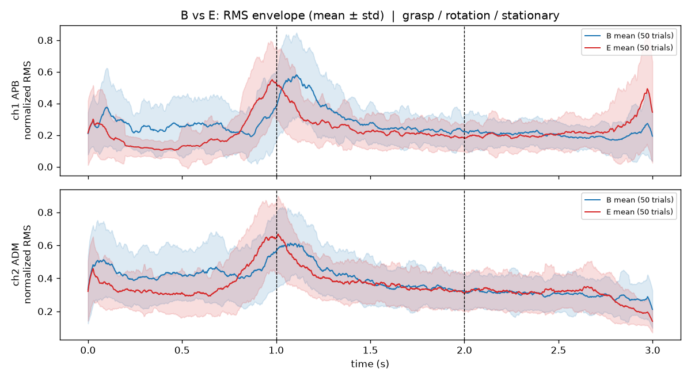

- 위 그림은 50시행의 RMS 포락선 평균 ± 표준편차다. 시행마다 최댓값을 1로 맞췄는데, 모델도 윈도우마다 min-max 정규화로 진폭을 지우기 때문이다. **파지 구간(0~0.8 s)에서 B의 표준편차 띠가 매우 넓어** E의 띠를 거의 덮는다. 평균만 보면 B의 활성이 더 높지만, 시행 하나하나로 보면 두 사람의 범위가 크게 겹친다. 회전이 시작되는 1초 부근에서는 E가 B보다 먼저 올라가 먼저 정점을 찍어 차이가 생긴다.

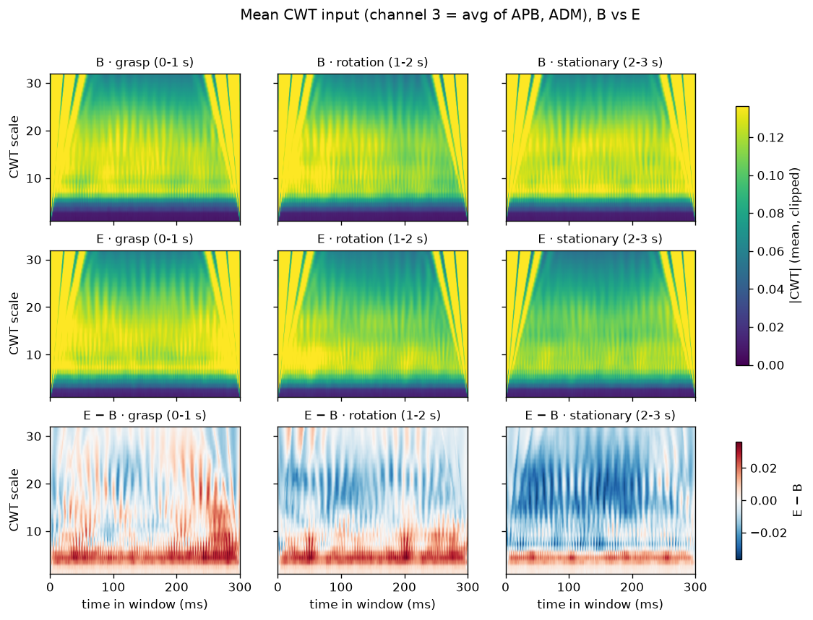

- 모델 입력과 같은 평균 CWT 지도다. 맨 아래 행(E − B)을 보면 **회전·정지 구간에서는 E가 중간 스케일(약 10~25)에서 B보다 일관되게 에너지가 낮다**(파란색). 이 차이가 E와 B를 가르는 단서다. **파지 구간에서는 이 차이가 거의 사라지고** 부호도 섞인다. E를 B와 구분하던 단서가 파지 구간에서만 약해진다는 뜻이며, E의 파지 구간 정확도(56%)만 떨어지는 현상과 맞는다.
- 학습 없는 최근접 중심 판별(시행마다 구간의 스펙트럼 프로파일 96차원, leave-one-trial-out)로도 확인했다(`week3/results/error_pair_analysis.md`). E의 정답률은 **파지 56% < 정지 72% < 회전 76%** 로, CNN(6모델 앙상블 기준 파지 56%, 회전 88%, 정지 92%)과 마찬가지로 파지 구간이 가장 낮다. 다만 이 단순한 방법에서 E의 파지 구간 오류는 B(6건)보다 C(10건)로 더 많이 갔다. 따라서 "파지 구간에서 E가 덜 구별된다"는 것은 신호 자체의 성질이지만, 그 오류가 **특히 B로 몰리는 것**은 시간 구조까지 보는 CNN이 학습한 특징에서 생긴 것으로 보는 것이 정직하다.
- 부수적 관찰: CWT 지도 양 끝(0 ms, 300 ms)의 큰 스케일에 모든 피험자에게 똑같이 나타나는 강한 **경계 효과**가 있다. 윈도우를 0~1로 정규화하면 평균이 0이 아니게 되는데, 이 상태로 짧은 윈도우를 변환하면 끝부분에서 웨이블릿이 신호 밖으로 걸쳐 생기는 현상이다. 입력의 상당 부분이 사람 구분과 무관한 정보라는 뜻이며, 논문과 같은 파이프라인이라 그대로 두었다(4절 한계 7).

### ResNet18

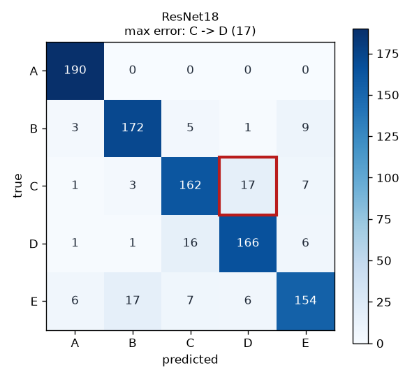

- **가장 잘 분류된 클래스**: A (190/190, 100%)
- **가장 많이 오분류된 클래스**: E (재현율 81.1%)
- **주요 오분류 유형**: **C → D 17건** (최대), E → B 17건, D → C 16건
- **오분류가 발생한 이유**: C ↔ D 양방향 혼동이 33건으로 가장 크다. 논문에서 지적한 D → C 쌍과 같다. 오류가 한 쌍에 몰리지 않고 E → B, E → A, B → E 등으로 **퍼져 있다**. 모델 용량이 작아 특정 쌍 하나를 못 가르는 것이 아니라 전반적으로 경계가 덜 날카롭다는 뜻이다.

### 2D CNN

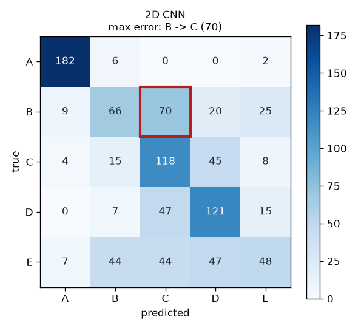

- **가장 잘 분류된 클래스**: A (182/190, 95.8%)
- **가장 많이 오분류된 클래스**: E (재현율 25.3%), B (34.7%)
- **주요 오분류 유형**: **B → C 70건** (최대), C → D 45건, D → C 47건, E는 B·C·D로 고르게 흩어진다(44/44/47건)
- **오분류가 발생한 이유**: 과소적합이다. 전역 평균 풀링으로 시간 정보가 사라져 "평균적인 주파수 분포"만 남는다. 피험자 간 차이가 큰 A만 구분되고 B~E는 사실상 뭉뚱그려진다. E는 거의 무작위로 흩어지는데, 이는 E가 가진 구분 단서(회전 구간의 패턴)가 시간 위치에 의존한다는 위 분석과도 맞는다.

### 1D CNN (가장 높은 모델)

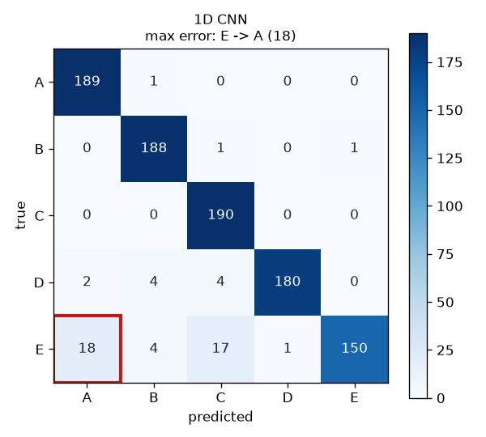

- **가장 잘 분류된 클래스**: C (190/190, 100%). A(99.5%)와 B(98.9%)도 거의 완벽하다.
- **가장 많이 오분류된 클래스**: E (재현율 78.9%, 40개 오류). 나머지 네 클래스의 오류는 다 합쳐도 13건이다.
- **주요 오분류 유형**: **E → A 18건** (최대), E → C 17건, E → B 4건
- **오분류가 발생한 이유**: 오류가 거의 전부 E에 몰려 있다. E의 재현율(78.9%)은 DenseNet161(80.0%)과 거의 같다. 즉 1D CNN이 DenseNet161보다 높은 이유는 E를 더 잘 맞혀서가 아니라 **B, C, D를 거의 완벽하게 가려서**다(DenseNet161의 C ↔ D 20건, D → B 8건이 1D CNN에서는 합쳐 8건). E의 오류 방향은 CWT 모델들과 다르다. CWT 모델은 E를 B로 착각했지만, 1D CNN은 A와 C로 착각한다. 원 신호에서 E의 약한 구간(파지 구간)이 어떤 파형으로 보이는지가 CWT에서와 다르기 때문으로 본다. E 재현율이 입력을 바꿔도 80% 근처에 머무는 것은, E의 약점이 모델이나 입력 표현보다 **E의 신호 자체**에 있다는 위 DenseNet161 분석과 맞는다.

### CNN–BiLSTM

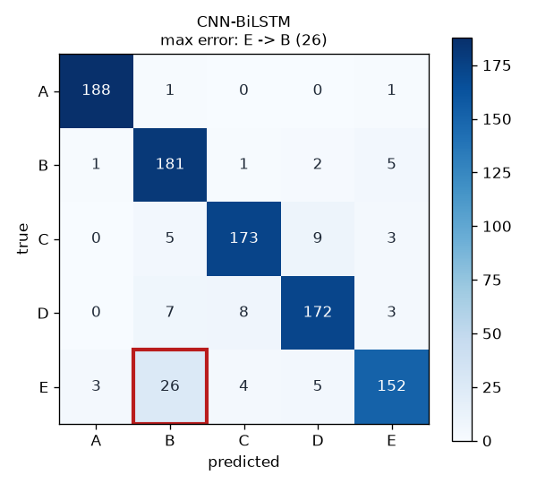

- **가장 잘 분류된 클래스**: A (188/190, 98.9%)
- **가장 많이 오분류된 클래스**: E (재현율 80.0%)
- **주요 오분류 유형**: **E → B 26건** (최대), C → D 9건, D → C 8건, D → B 7건
- **오분류가 발생한 이유**: 혼동행렬이 DenseNet161과 거의 같다(E → B 27건 vs 26건, E 재현율 둘 다 80.0%). 구조가 전혀 다른 두 모델이 같은 CWT 입력에서 같은 오류를 낸다는 것은, E → B가 **CWT 입력 표현에서 오는 오류**라는 근거다. BiLSTM이 시간 순서를 모델링해도 E의 파지 구간 문제는 풀리지 않았다.

### E2CNN

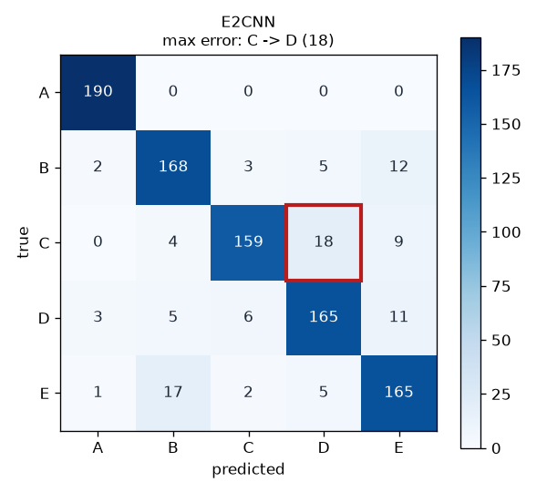

- **가장 잘 분류된 클래스**: A (190/190, 100%)
- **가장 많이 오분류된 클래스**: C (재현율 83.7%)
- **주요 오분류 유형**: **C → D 18건** (최대), E → B 17건, B → E 12건, D → E 11건
- **오분류가 발생한 이유**: 얕은 층과 깊은 층의 특징을 모두 이어 붙이는 구조라, 파라미터 8만 개로도 ResNet18(1,118만 개)보다 약간 높은 89.16%를 냈다. 대신 특정 쌍에 오류가 몰리지 않고 C → D, E → B, B → E, D → E로 **퍼져 있다**(E와 B는 양방향). 두 쌍의 경계를 어느 한쪽으로 확실히 정하지 못한다는 뜻으로, 모델 용량이 작을 때 흔한 모습이다(ResNet18과 비슷).

### CNN–LSTM–Attention

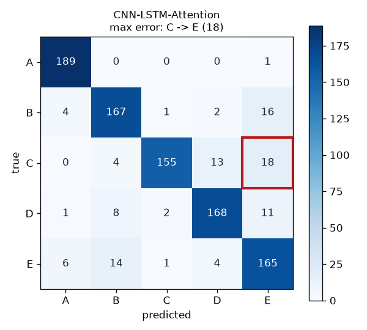

- **가장 잘 분류된 클래스**: A (189/190, 99.5%)
- **가장 많이 오분류된 클래스**: C (재현율 81.6%)
- **주요 오분류 유형**: **C → E 18건** (최대), B → E 16건, C → D 13건, D → E 11건
- **오분류가 발생한 이유**: 다른 모델과 반대로 **E가 "흡수하는" 클래스**가 됐다. E 예측이 211건으로 실제(190건)보다 많고, E의 정밀도는 78.2%로 가장 낮다. 그 덕분에 E의 재현율은 86.8%로 CWT 모델 중 가장 높다(E2CNN과 같음). attention이 시간 구간마다 가중치를 주는 과정에서 E와 닮은 구간(예: 파지 구간)에 큰 가중치가 실리면 다른 사람도 E로 판정하는 것으로 보인다. E와 다른 사람의 경계가 모호하다는 점은 같고, 어느 쪽으로 틀리는지만 바뀐 것이다.

### ConvNeXt

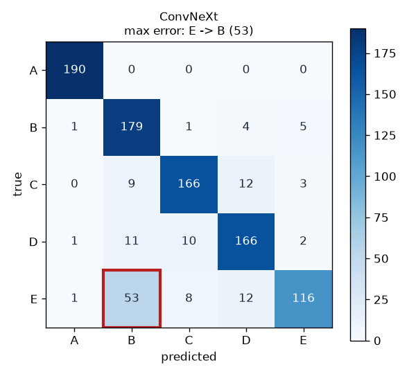

- **가장 잘 분류된 클래스**: A (190/190, 100%)
- **가장 많이 오분류된 클래스**: E (재현율 61.1%, 74개 오류)
- **주요 오분류 유형**: **E → B 53건** (최대, 모든 모델 중 가장 많음), E → D 12건, C → D 12건, D → B 11건
- **오분류가 발생한 이유**: E → B가 DenseNet161(27건)의 약 2배다. B 예측이 252건으로 B가 강하게 흡수한다. ConvNeXt의 첫 층(4×4 patchify, stride 4)이 32개 스케일을 곧바로 8칸으로 줄여, E와 B를 가르던 중간 스케일(약 10~25)의 차이(위 E·B CWT 비교)가 첫 층에서 뭉개졌을 가능성이 있다. 학습 loss도 0.40으로 다른 깊은 모델보다 높아, 이 데이터 크기에서 충분히 학습되지 않았다.

### Tri-CCNN

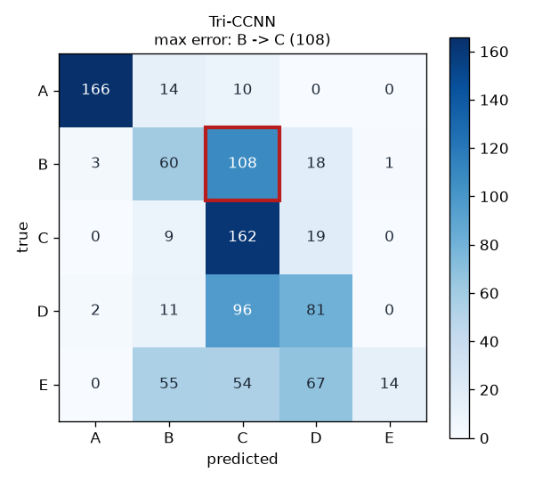

- **가장 잘 분류된 클래스**: A (166/190, 87.4%)
- **가장 많이 오분류된 클래스**: E (재현율 7.4%, 190개 중 14개만 맞힘)
- **주요 오분류 유형**: **B → C 108건** (최대), D → C 96건, E → D 67건, E → B 55건, E → C 54건
- **오분류가 발생한 이유**: 과소적합과 예측 쏠림이다. 전체 950건 중 430건을 C로 예측했고 E로는 15건만 예측했다. 그래서 정밀도(62.43%)와 F1(47.30%)이 크게 벌어진다. 논문에서도 Tri-CCNN만 정확도(81.79%)와 F1(71.78%)이 크게 벌어졌는데, 강의 PDF가 "특정 클래스에 예측이 쏠렸다는 신호"라고 설명한 현상이 여기서도 그대로 나타났다. 파라미터가 2,213개뿐이라 학습 loss가 1.18에서 내려가지 않았고, 초기화(seed)에 따라 쏠리는 클래스가 달라져 3회 결과가 42~54%로 흔들렸다. 근사 재구현이라 원 논문 구조보다 불리했을 가능성도 있다.

### (참고) DenseNet161 6모델 앙상블

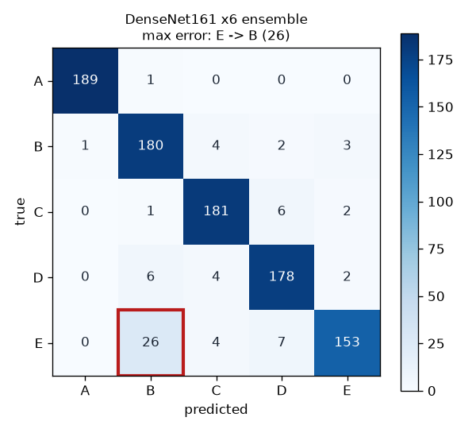

- C ↔ D 오류가 20건에서 10건으로 절반이 됐다. 그러나 **E → B는 27건에서 26건으로 그대로**였다. 앙상블은 모델마다 다르게 틀리는 "변동성 오류"는 줄이지만, 모든 모델이 똑같이 틀리는 E → B 같은 "구조적 오류"는 줄이지 못한다.

---

## 4. 최종 결과

- **가장 성능이 좋은 모델**: **1D CNN** (단일 94.42% / F1 94.29%, 3회 평균 93.58 ± 0.73%). 베이스라인이 제안 모델보다 높게 나왔으며, 슬라이드 지시대로 그대로 보고한다. 파라미터 9,589개, 학습 63초, 추론 1.04 ms로 가장 싸기도 하다.
- **제안 모델 DenseNet161**: 단일 91.37% / F1 91.35%, 3회 평균 90.53%, 10-fold 90.53 ± 1.57%, 참고로 6모델 앙상블 92.74%. **CWT 입력 모델 8종 중에서는 가장 높았다**(CNN–BiLSTM 91.16%와 거의 같음). 10-fold Wilcoxon 검정에서 2D CNN, ResNet18보다 유의하게 높았다(p < 0.05).
- **가장 성능이 낮은 모델**: Tri-CCNN (50.84% / F1 47.30%, 3회 평균 48.88%). 그다음은 2D CNN(56.32% / F1 54.79%)이다. 둘 다 과소적합이다. 2D CNN은 슬라이드의 최소 구조(파라미터 19,717개)라 논문의 2D CNN(약 494만 개, 91.58%)과는 다른 모델이다. Tri-CCNN은 근사 재구현이다.
- **주요 오분류 클래스**: **E**(9개 중 7개 모델에서 재현율 최저). CWT 모델에서는 **E → B**(DenseNet161 27건, ConvNeXt 53건)로, 원 신호 모델(1D CNN)에서는 E → A·C로 나타난다. 원인은 E의 파지 구간(0~1 s) 신호다. 부차적으로 CWT 모델에서 C ↔ D 혼동이 있는데, 이는 논문과 같은 쌍이다.

### 논문과 다르게 나온 이유

단일 split 테스트 정확도는 91.37%로 논문(94.00%)보다 2.6%p 낮다. 5-fold 평균은 90.76 ± 1.44%로 논문(91.66 ± 2.78%)보다 0.9%p 낮지만, 논문의 표준편차(±2.78%) 범위 안이고 우리 쪽 표준편차(±1.44%)는 더 작다. 즉 여러 번 나눠 평가한 기준으로는 논문과 **비슷한 수준을 재현**했다고 볼 수 있다. 단일 split에서 94.00%와 차이가 난 가장 큰 원인은 **테스트셋이 작다**는 점이라고 본다. 피험자당 테스트 시행이 10개뿐이므로 **시행 하나(19윈도우)를 통째로 틀리면 그 피험자 정확도가 10%p 흔들린다**. 실제로 같은 레시피에서 seed만 바꿔도 테스트 정확도가 90.11~91.37%로 달라졌고, 2주차 초기 설정 두 개(88.21%, 89.05%)는 D 피험자 정확도가 93.7% ↔ 87.9%로 뒤집혔다. 논문의 분할(어떤 시행이 테스트에 들어갔는지)은 공개되지 않았으므로 94.00%라는 단일 수치를 그대로 맞히는 것은 기대하기 어렵다. 대신 교차검증 평균과 표준편차로 비교하는 것이 더 공정하다. 최대 오류 쌍이 논문(D → C)과 다르게 E → B로 나온 것도 같은 이유로, 어느 E 시행이 테스트에 들어갔는지에 따라 달라질 수 있다. 실제로 논문의 5-fold 최고 fold 혼동행렬(Figure 5)에서는 E가 가장 낮고 E → B가 8건 나와, 분할이 바뀌면 E → B 쪽 오류가 커질 수 있음을 논문 자료로도 확인할 수 있다. 다만 C ↔ D 혼동은 여기서도 두 번째로 큰 오류로 나타났다.

**베이스라인 순위가 논문과 다르게 나온 이유**도 따로 적는다. 논문에서는 1D CNN(86.63%)이 DenseNet161(94.00%)보다 7%p 이상 낮았지만, 우리 실험에서는 1D CNN이 94.42%로 가장 높았다. 가능한 이유는 다음과 같다. (1) 우리는 논문에 없는 weight decay, cosine scheduler, 증강을 **모든 모델에 똑같이** 적용했다. 게다가 1D CNN에는 BatchNorm을 넣었다. 논문이 베이스라인을 어떤 설정으로 학습했는지는 공개되지 않았지만, 이런 보강이 작은 모델의 성능을 크게 올렸을 수 있다. (2) 논문의 1D CNN 구조는 공개되지 않아, 파라미터 수(9,589개)만 같게 맞춘 우리 구조와 실제로는 다를 수 있다. (3) 테스트 분할이 다르다. 따라서 "1D CNN이 DenseNet161보다 낫다"는 결론은 **우리 분할과 우리 학습 레시피에서의 결과**다. 이를 일반화하려면 같은 fold에서 10-fold 검정을 하고, BatchNorm 유무와 입력(원 신호/CWT)을 하나씩 바꾸는 비교가 더 필요하다.

### 한계

1. **피험자 5명의 closed-set 문제다.** 모델은 "등록된 5명 중 누구와 가장 비슷한가"만 답하므로, 등록되지 않은 사람이 문을 잡아도 반드시 5명 중 한 명으로 판정한다. 실제 출입 인증에 쓰려면 미등록자를 거부하는 open-set 판정(예: 확신도 임계값)과 더 많은 사용자에 대한 검증이 필요하다.
2. **단일 세션 데이터다.** 50시행이 같은 날, 같은 전극 부착 상태에서 기록되어 학습과 테스트 시행이 매우 가까운 조건을 공유한다. 전극을 다시 붙이거나 며칠이 지나 피부 상태·근피로가 달라지면 신호가 바뀌므로, 세션 간 일반화 성능은 이 결과보다 낮을 가능성이 크다.
3. **실험실 조건이다.** 정해진 손잡이를 정해진 동작(파지-회전-정지 각 1초)으로 돌렸다. 실제 환경에서는 문 종류, 잡는 손, 짐을 든 상태, 서두름 등으로 동작 속도와 힘이 달라진다. E의 파지 구간처럼 동작이 조금만 흔들려도 정확도가 크게 떨어진 것을 보면 이 변화에 민감할 수 있다.
4. **테스트셋이 작고, 개선 과정에서 반복 사용했다.** 피험자당 테스트 시행이 10개라 시행 하나가 10%p를 좌우한다. 또 2주차의 개선(레시피 변경, 앙상블 구성)을 이 같은 테스트셋의 정확도를 보며 골랐으므로, 앙상블 92.74%에는 테스트셋에 맞춰진 낙관적 편향이 들어 있을 수 있다. 이 때문에 5-fold 교차검증 결과를 함께 보고한다.
5. **논문 설정과 일부 다르다.** weight decay, cosine scheduler, 데이터 증강은 논문에 없는 추가 기법이다. Dropout 비율(0.5)도 논문에 수치가 명시되지 않아 임의로 정했다. 베이스라인 8종 중 ResNet18과 ConvNeXt만 공개 구조를 그대로 썼다. 나머지는 논문의 설명과 파라미터 규모에 맞춰 직접 구성했고, 특히 E2CNN과 Tri-CCNN은 입력까지 바꾼 근사 재구현이다. 따라서 이 결과는 논문 방법의 엄밀한 재현이라기보다 "같은 파이프라인에 학습 기법을 보강한 결과"로 봐야 하며, 베이스라인의 절댓값(특히 1D CNN 94.42%, Tri-CCNN 50.84%)을 논문 수치와 1:1로 비교하기는 어렵다.
6. **제안 모델의 연산 비용이 크다.** DenseNet161은 파라미터 2,648만 개, 샘플 1개 추론에 약 33 ms가 걸려 ResNet18보다 약 7배, 1D CNN보다 약 32배 느리다. GPU 노트북에서는 문제가 없지만, 문손잡이에 넣을 저전력 임베디드 장치에서는 그대로 쓰기 어렵다. 이 데이터에서는 더 작은 1D CNN이 오히려 정확했으므로, 실제 장치라면 1D CNN 같은 경량 모델이 더 알맞다.
7. **입력 표현에 사람 구분과 무관한 성분이 섞여 있다.** 3절에서 보았듯 윈도우별 min-max 정규화 뒤 300 ms 창을 바로 CWT하면, 창 양 끝의 큰 스케일에 모든 피험자에게 같은 모양의 경계 효과가 크게 생긴다. 모델이 이 부분을 무시하도록 스스로 배워야 하므로 작은 모델(2D CNN)에는 특히 불리했을 수 있다. 정규화 전 평균 제거나 창 양 끝을 잘라내는 방식으로 줄일 수 있겠지만, 논문 파이프라인과 달라지므로 이번에는 시험하지 않았다.

### 전체적인 실험 결과 및 느낀 점

같은 전처리와 같은 학습 조건에서 모델만 바꿨는데 정확도가 48.88%(Tri-CCNN)부터 94.42%(1D CNN)까지 크게 달라졌다. CWT를 입력으로 쓰는 모델들 사이에서는 DenseNet161이 가장 높아, 정보가 적은 입력에서 특징을 깊게 쌓고 재사용하는 구조가 유리하다는 논문의 주장을 확인할 수 있었다. 5-fold 교차검증 평균(90.76 ± 1.44%)도 논문(91.66 ± 2.78%)과 표준편차 범위 안에 들어와, 제안 모델의 성능은 대체로 재현했다고 생각한다.

그런데 논문의 베이스라인 8종을 모두 같은 조건으로 돌려 보니, 가장 단순한 **1D CNN이 제안 모델보다 높게 나왔다.** 처음에는 실험이 잘못된 줄 알았지만, seed를 세 번 바꿔도 순위가 같았다. 같은 데이터 분할과 레이블을 쓴다는 것도 코드로 확인했다. 슬라이드의 "베이스라인이 더 좋게 나와도 그대로 보고할 것"이라는 문장이 왜 있는지 알게 됐다. 처음 과제 요구대로 베이스라인 두 개(2D CNN, ResNet18)만 비교했다면 "DenseNet161이 가장 좋다"고 결론 냈을 것이다. 비교 대상을 넓혀야 주장이 믿을 만해진다는 강의 내용을 결과로 직접 겪었다. 또 1D CNN과 CWT 모델들이 E를 서로 다른 사람으로 착각하는 것을 보고, 오류의 방향이 모델보다 **입력 표현**에 따라 정해진다는 것을 알게 됐다.

가장 크게 느낀 점은 **숫자를 올리는 것보다 왜 틀리는지를 아는 것이 더 어렵고 더 중요하다**는 것이다. 2주차에 5에폭 76.74%에서 시작해 에폭 수를 늘리고, 정규화와 증강을 넣고, 여러 모델을 앙상블하면서 92.74%까지 올렸지만 E 피험자 정확도는 끝까지 80% 근처에서 멈춰 있었다. 앙상블 크기나 CWT 스케일을 바꿔도 E → B 오류가 줄지 않는 것을 보고 나서야 "모델마다 다르게 틀리는 오류"와 "모든 모델이 똑같이 틀리는 오류"가 다르다는 것을 알게 됐고, 윈도우 위치별로 쪼개 본 뒤에야 원인이 E의 파지 구간(0~1 s)이라는 것을 찾을 수 있었다. 처음에 예상했던 원인(1주차에 본 정지 구간 끝의 스파이크)과 실제 원인이 달랐던 것도 인상 깊었다. 데이터를 직접 쪼개서 확인하지 않았다면 계속 모델만 바꾸고 있었을 것이다.

또 **평가 방법에 따라 같은 모델의 숫자가 크게 달라진다**는 것을 배웠다. 같은 예측을 시행 단위 다수결로 다시 세면 100%가 나오고, 단일 split은 seed만 바꿔도 1%p 이상 흔들렸다. 테스트셋을 보면서 설정을 고르면 결과가 부풀려질 수 있다는 것도 알게 되어, 최종 비교는 단일 모델과 교차검증 기준으로 하고 앙상블은 참고로만 적었다. 높은 숫자 하나보다 어떤 조건에서 나온 숫자인지를 함께 밝히는 것이 더 정직한 보고라고 생각한다.

마지막으로, 모델이 크다고 항상 좋은 것은 아니었다. 파라미터가 가장 많은 ConvNeXt(2,782만 개)는 과소적합한 소형 모델 둘을 빼면 가장 낮았고, 가장 작은 축인 1D CNN(9,589개)이 가장 높았다. 실제 문손잡이처럼 작은 장치에 넣는다면 1D CNN 같은 가벼운 모델이 성능과 속도 모두에서 더 현실적인 선택이다. 정확도 하나만이 아니라 속도, 크기, 그리고 등록되지 않은 사람을 거부할 수 있는지까지 함께 따져야 실제로 쓸 수 있는 인증 시스템이 된다는 점을 느꼈다.

---

## 5. 재현 정보

| 항목 | 값 |
|---|---|
| OS | Windows 11 |
| GPU | NVIDIA GeForce RTX 3060 Laptop GPU (6 GB) |
| Python | 3.14.0 |
| 주요 패키지 | torch 2.11.0+cu128, torchvision 0.26.0, numpy 2.5.3, scipy 1.18.1, scikit-learn 1.9.1, PyWavelets 1.10.0 |
| Seed | 데이터 분할 42, 교차검증 분할 42, 학습 1 (3회 실행 평균과 앙상블 구성 모델은 2, 3도 사용) |
| 실행 순서 | 위 1.5절 |

모델 가중치(`.pt`, 1개당 최대 약 111 MB)와 데이터셋(`.npz`, CWT 약 500 MB, 원 신호 `raw_dataset.npz`)은 GitHub 용량 제한 때문에 저장소에 넣지 않았다. 위 실행 순서로 다시 만들 수 있다.
